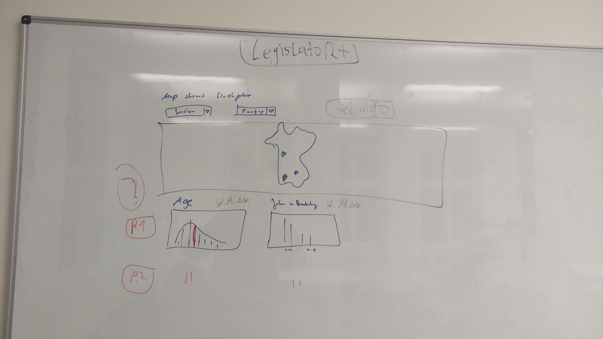

```{r setup, include=FALSE}
# knitr chunk options
knitr::opts_chunk$set(echo=FALSE, message=FALSE, warning=FALSE)

# packages
library(tidyverse)
library(legislatoR)
library(cranlogs)
library(kableExtra)
library(lubridate)
```

# `legislatoR+`

## Executive Summary

`legislatoR+` is a dashboard project from Benedikt Ströbl and Lukas Warode with the goal to provide an accessible and useful visual tool for the existing `legislatoR` R package. `legislatoR` itself is based on *The Comparative Legislators Database* (Göbel and Munzert, 2021), a far-reaching political science data project that provides both comprehensive information for over 45,000 politicians from ten countries while also including linking possibilities to other research databases within the political science context.

`legislatoR+` provides (in the preliminary version) several options of visual communication, including a constituency-based map and 2 descriptive plots. All graphical elements are based on `Shiny's` reactive infrastructure.

For reasons of accessibility and simplicity that comes with avoiding large data handling issues -- the scope of available data differs across the ten countries -- the preliminary version for the final project is based on a German sample starting with the 15th legislative period (*Bundestagswahl 2002*).

## Statement of Contribution

Most of the project work ran in a very collaborative dynamic. In the preliminary stages, there was a lively exchange between both project members, with most of the ideas and theoretical approaches of the project having been implicitly worked on in two parts.

In the advanced and practical stages, a certain division of labor crystallized. However, a large part of the project was approached in a co-working place, which is why many practical projects and especially problems were evaluated directly together.

In detail, the division of work was as follows:

- __Benedikt Ströbl__ mainly took care of the configuration of the HTML template and handled the different map data formats. He also created the visual map base with special emphasis on the constituencies and the implied data matching and wrangling tasks.

- __Lukas Warode__ was mainly involved in setting up the Shiny backend and did a lot of the practical data manipulation inside and outside the `Shiny` reactivity. He also worked on the `ggplot2` foundation of descriptive statistics and configured the visual and written outline of the `R Markdown` report.

<br/>

---

# Goal and Motivation

Many research projects in academia suffer from lacking visibility, even though their scope and findings could be relevant and appealing to a broader audience. The same is true for scientific articles in general, however, especially data-driven research projects exhibit great potentials for further research ideas and serve as a crucial foundation in the domain of genuine knowledge generation.

In this context, setting up a proper and suitable dashboard should function as an instrument of appealing and barrier-free visual communication. The goal of the dashboard -- `legislatoR+` -- is to reach both an academic and non-academic audience while generally trying to increase the visibility and accessibility of *The Comparative Legislators Database*, or rather the `legislatoR` package.

## State of the `R` package `legislatoR`

<div class = "row">
<div class = "col-md-9">
The package `legislatoR` is available on CRAN since April 2020. The download dynamics of the package are shown in **Figure 1**. It is hard to observe a clear pattern or direction within the download behavior, however, in the year 2020, there is a small downward trend observable. Since fall 2021, the download pattern is showing an increase again, while showing some days with surpassingly high download numbers.

The table on the the right side is indicating the quarterly download numbers. The quarterly downloads range from 920 (last quarter 2020) to 1258 (last quarter 2021). The highest number of downloads in the ongoing quarter could be an indicator that the package or rather the project itself is facing an increased importance and visibility.
</div>

<div class = "col-md-3">

</div>
</div>

</br>

```{r}
source(here::here("theme_lgl.R"))

downloads_lgl <- cran_downloads(
  packages = "legislatoR",
  # Date of package documentation
  from = as.Date("2020-04-24"),
  to = Sys.Date()
)
```

<div style="text-align: right"> **Figure 1: Downloads of `legislatoR`** </div>
<div class = "row">
<div class = "col-md-6">
```{r}
downloads_lgl %>% 
  ggplot(aes(x = date, y = count)) + 
  geom_point(alpha = 0.5) +
  geom_smooth() + 
  theme_lgl() +
  labs(title = "Daily Downloads of legislatoR (CRAN)",
       x = "Date",
       y = "Download (N)") + 
  scale_x_date(breaks = "3 months", date_labels = "%B %Y")
```
</div>

<div class = "col-md-6">
```{r}
downloads_lgl %>% 
  mutate(year = year(date),
         quarter = quarter(date)) %>% 
  group_by(year, quarter) %>% 
  summarise(download_month = sum(count)) %>% 
  ungroup %>% 
  rename("Year" = 1, "Quarter" = 2, "Download (N)" = 3) %>% 
  kbl() %>% 
  kable_paper()
```
</div>
</div>

## Visual Conception and Ideas

**Figure 2** shows a sketch made by both project members that shows. Note: The [Appendix] includes another sketch that exhibits a more detailed and analytical approach of the dashboard.

<div style="text-align: right"> **Figure 2: Picture of Dashboard Sketch** </div>


---

# Project Infrastructure

## Used Data

The package `legislatoR` provides nine individual tables that can be both used individually and combined after merging with the respective key variables. For the scope of this project, the tables **Core**, **Political**, **Social** and **Portraits** are used, which are highlighted in **Figure 2**. All four tables can be merged using the **pageid** key variable.

The respective tables are used for different purposes within `legislatoR+'s` scope:

- **Core** serves as the main table and provides sociodemographic information on legislators. For the scope of `legislatoR+`, the variables `name`, `birth` and `death` are very important. The last two are used in order to compute the individual age of legislators.

- **Political** provides relevant information of the genuine political activity of included legislators. The table serves as the essential source of communicated information in the dashboard project. The variable `session` represents the legislative period of the MP (*Member of Parliament*), while `party` indicates the party affiliation of the politician. Both variables play a crucial role for the displayed plots in the dashboard. Furthermore, `constituency` is used to map the MPs per legislative period, while `session_start` and `session_end` serve for computing the maximum term length of individual MPs.

- **Social**: @BENEDIKT

- **Portraits** just includes the variable `image_url` next to the `pageid`. `image_url` provides the URL to the portrait images that are displayed on the respective (English) Wikipedia articles. The portrait images serve as an important visual element within the map of the dashboard and are also representing a crucial recognition value for the audience inside and outside of academia.

<div style="text-align: right"> **Figure 3: Data Tables in Usage** </div>
<div class = "row">
<div class = "col-md-6">

</div>

<div class = "col-md-6">
| Table       | Function            | Description                                                           | Key                |
| :---------- | :------------------ | :-------------------------------------------------------------------- | :----------------- |  
| **Core**        | **`get_core()`**        | **Fetches sociodemographic data of legislators**                          | **pageid, wikidataid** |
| **Political**   | **`get_political()`**   | **Fetches political data of legislators**                                 | **pageid**             |
| History     | `get_history()`     | Fetches full revision histories of legislators' Wikipedia biographies | pageid             |
| Traffic     | `get_traffic()`     | Fetches daily user traffic on legislators' Wikipedia biographies      | pageid             |
| **Social**      | **`get_social()`**      | **Fetches social media handles and website URLs of legislators**          | **wikidataid**         |
| **Portraits**   | **`get_portrait()`**    | **Fetches portrait urls of legislators**                                  | **pageid**             |
| Offices     | `get_office()`      | Fetches political and other offices of legislators                    | wikidataid         |
| Professions | `get_profession()`  | Fetches occupational data of legislators                              | wikidataid         |
| IDs         | `get_ids()`         | Fetches a range of IDs of legislators                                 | wikidataid         |
</div>
</div>


<!-- | Country                              | Legislative sessions        | Politicians (unique) | Integrated with    | -->
<!-- | ------------------------------------ | --------------------------- | -------------------- | ------------------ | -->
<!-- | Austria (Nationalrat)                | all 27<br /> (1920-2019)    | 1,923                | [ParlSpeech V2](https://dataverse.harvard.edu/dataset.xhtml?persistentId=doi:10.7910/DVN/L4OAKN) (Rauh/Schwalbach 2020)      | -->
<!-- | Canada (House of Commons)            | all 43<br /> (1867-2019)    | 4,515                |                    | -->
<!-- | Czech Republic (Poslanecka Snemovna) | all 8<br /> (1992-2017)     | 1,020                | [ParlSpeech V1](https://dataverse.harvard.edu/dataset.xhtml?persistentId=doi:10.7910/DVN/E4RSP9) (Rauh et al. 2017)          | -->
<!-- | France (Assemblée)                   | all 15<br /> (1958-2017)    | 3,933                |                    | -->
<!-- | ***Germany (Bundestag)***                  | ***all 19<br /> (1949-2017)***    | ***4,075***                | ***[BTVote data](https://dataverse.harvard.edu/dataverse/btvote) (Bergmann et al. 2018),<br /> [ParlSpeech V1](https://dataverse.harvard.edu/dataset.xhtml?persistentId=doi:10.7910/DVN/E4RSP9) (Rauh et al. 2017),<br /> [Reelection Prospects data](https://dataverse.harvard.edu/dataset.xhtml?persistentId=doi:10.7910/DVN/EBEDPI) (Stoffel/Sieberer 2017)***   | -->
<!-- | Ireland (Dail)                       | all 33<br /> (1918-2020)          | 1,408                |	[Database of Parliamentary Speeches in Ireland](https://dataverse.harvard.edu/dataset.xhtml?persistentId=doi:10.7910/DVN/6MZN76) (Herzog/Mikhaylov 2017)	| -->
<!-- | Scotland (Parliament)                | all 5<br /> (1999-2016)           | 305                  | [ParlScot](https://dataverse.harvard.edu/dataset.xhtml?persistentId=doi:10.7910/DVN/EQ9WBE) (Braby/Fraser 2021)      			 | -->
<!-- | Spain (Congreso de los Diputados)    | all 14<br /> (1979-2019)          | 2634           | [ParlSpeech V2](https://dataverse.harvard.edu/dataset.xhtml?persistentId=doi:10.7910/DVN/L4OAKN) (Rauh/Schwalbach 2020)      |         -->
<!-- | United Kingdom (House of Commons)    | all 58<br /> (1801-2019)          | 13,215               | [EggersSpirling data](https://github.com/ArthurSpirling/EggersSpirlingDatabase) (starting from <br /> 38th session, Eggers/Spirling 2014),<br /> [ParlSpeech V1](https://dataverse.harvard.edu/dataset.xhtml?persistentId=doi:10.7910/DVN/E4RSP9) (Rauh et al. 2017) |  -->
<!-- | United States (House and Senate)     | all 116<br /> (1789-2019)         | 12,512               | [Voteview data](https://voteview.com/data) (Lewis et al. 2019), <br /> [Congressional Bills Project data](http://www.congressionalbills.org/) (Adler/Wilkserson 2018) | -->

## Constraints

The scope of this version (Final Data Science Project) includes some constraints. From the ten country sample, only legislators from Germany are used that are chronologically at least part of the 15th legislative period. The current state of `legislatoR` does not include the most recent legislative period of the *Bundestag* (20), hence, MPs from legislative period 15 to 19 are part of `legislatoR+'s` sample.

The *cut-down* version of `legislatoR+` (in relation to the full dataset) is mainly due to two reasons: First, the scope of this project is to introduce *The Comparative Legislators Database* in a visual and approachable manner. A small subset of the database is a better fit for this goal since the chances of potential overstrainings are reduced while performance and accessibility are increased. Second, one of the core visual elements is a `leaflet` map, which is serving as a constituency-based choropleth map, was rather complex to set up. Providing a stable and dynamically adjusted choropleth map based on the given untidy and unmerged datasets -- including the changing geographical and political boundaries of German constituencies -- was already a work-heavy and detailed task.

```{r, echo=TRUE}
deu_political <- get_political("deu")

paste0(
  "Number of Observations: ",
  deu_political %>% 
  filter(session >= 15) %>% 
  nrow
)

paste0(
  "Number of Unique Observations: ",
  deu_political %>% 
  filter(session >= 15) %>% 
  distinct(pageid) %>% 
  nrow
)
```

## Functionality

---

# Scalability

One of the main goals of `legislatoR+` is to function as a visual appealing and intuitive access to the `legislatoR` database. However, the long-run goal of the dashboard application is also to include more functionalities in addition to expanding the scope of used data. Both parts of the long-run goal are referring to then concept of *scalability*: Based on the existing framework of the final project scope, new features -- in the form of additional "dashboard views" or added data -- should be easy to add while also representing a useful addition to the existing scope.

## Visibility

A useful and accessible dashboard should increase the vision of its underlying database. Both the package `legislatoR` and the *Comparative Legislators Database* itself should be positively affected by a useful dashboard. There should also be a strong synergy between newly added elements and reached target audience. For instance, it can be assumed that potential users from a certain country are more likely to use the dashboard when there country is also part of the application. Increasing visibility within academia would also imply that certain data tables from the *Comparative Legislators Database* that are of particular interest for a research-affine group could be added according to a *intra-academic demand* principle. While the dashboard in the final project version does not feature any analytical or even causal elements, those statistical features normally exhibit more differentiated insights and are thus specifically relevant for the academic context.

## Modularity

The principle of *modularity* is directly implied theoretically and especially practically in the notion of scalability. In practical terms, modularity refers to a system that enables new features to be added in a very straightforward and inherent manner. For `legislatoR+` this would translate to adding visual and analytical elements of the `legislatoR` package that are easy to implement in the given dashboard structure. The current dashboard is mainly set up by 3 visual elements: A comprehensive choropleth map and two plots that communicate descriptive statistics. Adding a new map would be rather complicated and implying a lot of obstacles, while modularly adding new elements, for instance new information for the MPs and more legislative periods, would be a rather straightforward approach. The two existing plots could also be easily expanded or complemented by similar visual features that are based on the same level of inputs in `Shiny's` reactivity context.

# Obstacles and Problems

---

# Outlook and Conclusion

---

# Appendix

## Preliminary Idea


---

# References

Göbel, S., & Munzert, S. (2021). The Comparative Legislators Database. British Journal of Political Science, 1-11. doi:10.1017/S0007123420000897

<!-- Name (Date). Title [Type]. doi:10.5281/zenodo.XXXX -->
